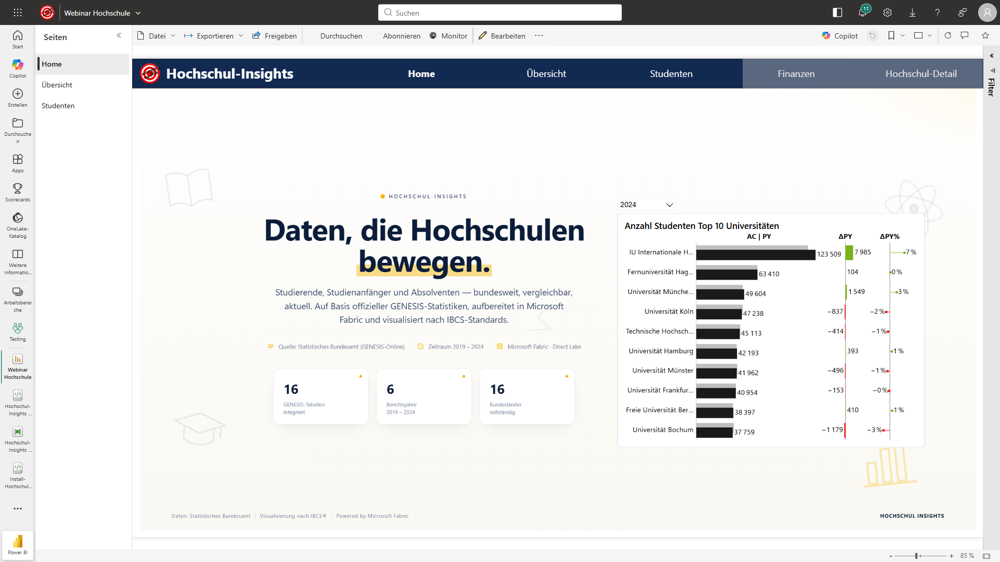
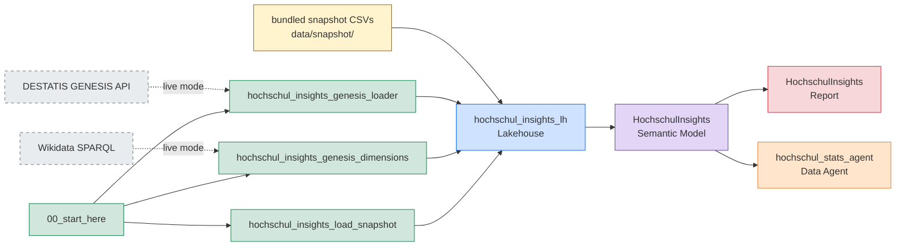

# Hochschul-Insights — Fabric Jumpstart

End-to-end analytics on German higher-education data from DESTATIS GENESIS-Online — bundled snapshot for zero-config exploration, optional live refresh via a free API token.

> **One line to deploy:** `jumpstart.install("hochschul-insights")`



## What you get

Deployed into your Fabric workspace under a single folder:

| Item | Name | Purpose |
|---|---|---|
| Lakehouse | `hochschul_insights_lh` | Schemas enabled, schema `Genesis`, 16 Delta tables |
| Notebook | `00_start_here` | Entry point — picks snapshot vs live mode |
| Notebook | `hochschul_insights_load_snapshot` | Snapshot mode loader (reads bundled CSVs) |
| Notebook | `hochschul_insights_genesis_loader` | Live mode — pulls DESTATIS GENESIS API |
| Notebook | `hochschul_insights_genesis_dimensions` | Wikidata enrichment + dimension builder |
| Data Pipeline | `hochschul_insights_pipeline` | Orchestrates parallel live loads |
| Semantic Model | `HochschulInsights` | Direct Lake, IBCS measures, Calendar |
| Report | `HochschulInsights` | 8 pages, IBCS-styled, Azure Map of 422 Hochschulen |
| Data Agent | `hochschul_stats_agent` | Natural-language Q&A on the semantic model |

## Two install modes

| Mode | Token? | Time | Data |
|---|---|---|---|
| **Snapshot** (default) | none | ~1 min | Bundled CSVs (see `data/manifest.json` for snapshot date) |
| **Live** | free DESTATIS token | ~10–15 min | Fresh pull from DESTATIS + Wikidata enrichment |

Switch modes any time by editing the `GENESIS_TOKEN` parameter in `00_start_here` and running it again.

### Get a free DESTATIS token (live mode only)

1. Register at [www-genesis.destatis.de](https://www-genesis.destatis.de/) — free.
2. Profile → API → Token kennzeichen.
3. Copy the **username** token.

## Install

### Via the Fabric Jumpstart Python API

```python
import fabric_jumpstart as jumpstart
jumpstart.install("hochschul-insights")
```

After deploy:
1. Open the `hochschul-insights` workspace folder.
2. Open `00_start_here`.
3. (Optional, for live mode) paste your DESTATIS token into the parameters cell.
4. **Run all.**
5. Open the `HochschulInsights` report.

### Cleanup

Delete the `hochschul-insights` workspace folder. Every deployed item is inside it.

## Data lineage



## Snapshot details

See [`data/manifest.json`](data/manifest.json) for snapshot date, row counts, and the list of source GENESIS table codes.

## Limitations

- Free DESTATIS token has rate + size limits. The loader splits large tables year-by-year. A few very large per-Bundesland tables are intentionally disabled.
- Snapshot mode does not include Wikidata enrichment refresh — the bundled `Hochschulen.csv` already has lat/lon/city.

## Pages in the report

1. **Home** — landing
2. **Übersicht** — totals + Azure Map of all 422 Hochschulen
3. **Studenten** — student counts × Fächergruppe / BL / Hochschulart / Geschlecht
4. **Personal** — academic + administrative staff
5. **Finanzen** — income, expenses, third-party funding
6. **Detail** — drill-through to single Hochschule
7. **About** — sources + license
8. **Hilfe** — usage notes

## Licence

- Code: [MIT](LICENSE)
- Data: Datenlizenz Deutschland 2.0 (commercial use OK with attribution: *Statistisches Bundesamt (Destatis), GENESIS-Online*)
- Wikidata enrichment: CC0

## Links

- DESTATIS GENESIS-Online: <https://www-genesis.destatis.de/>
- Fabric Jumpstart: <https://github.com/microsoft/fabric-jumpstart>
- Author blog: <https://actionablereporting.com/>
